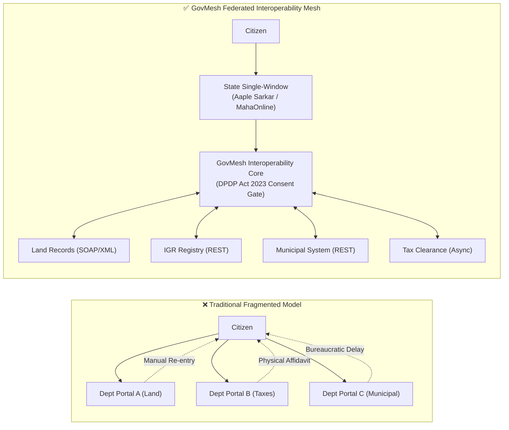
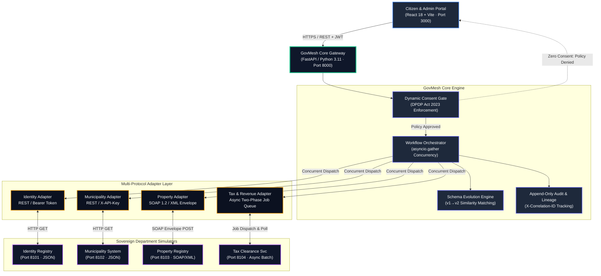
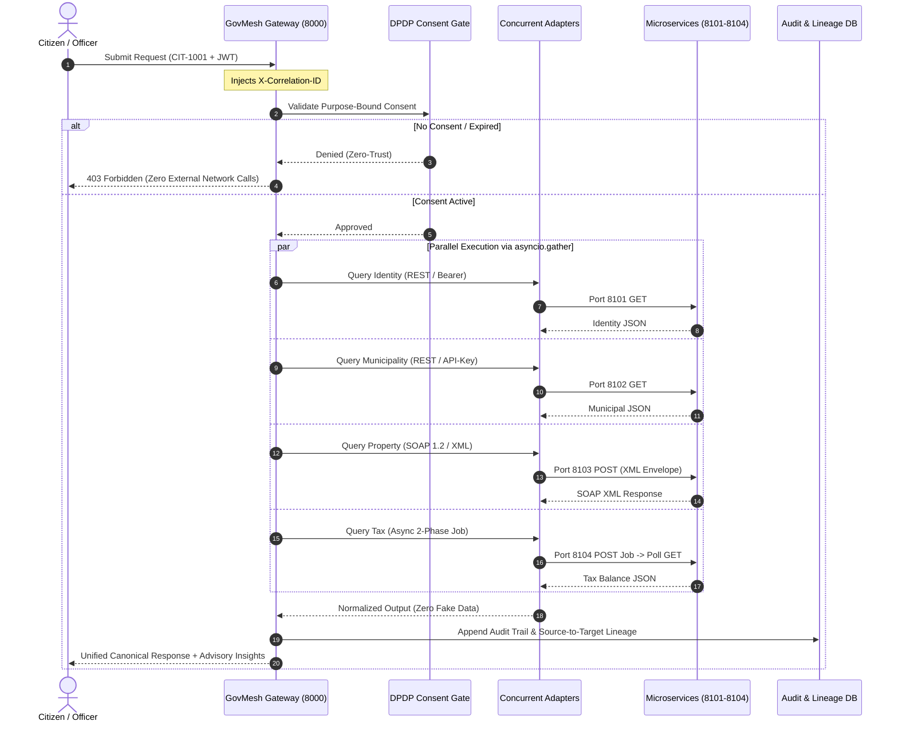
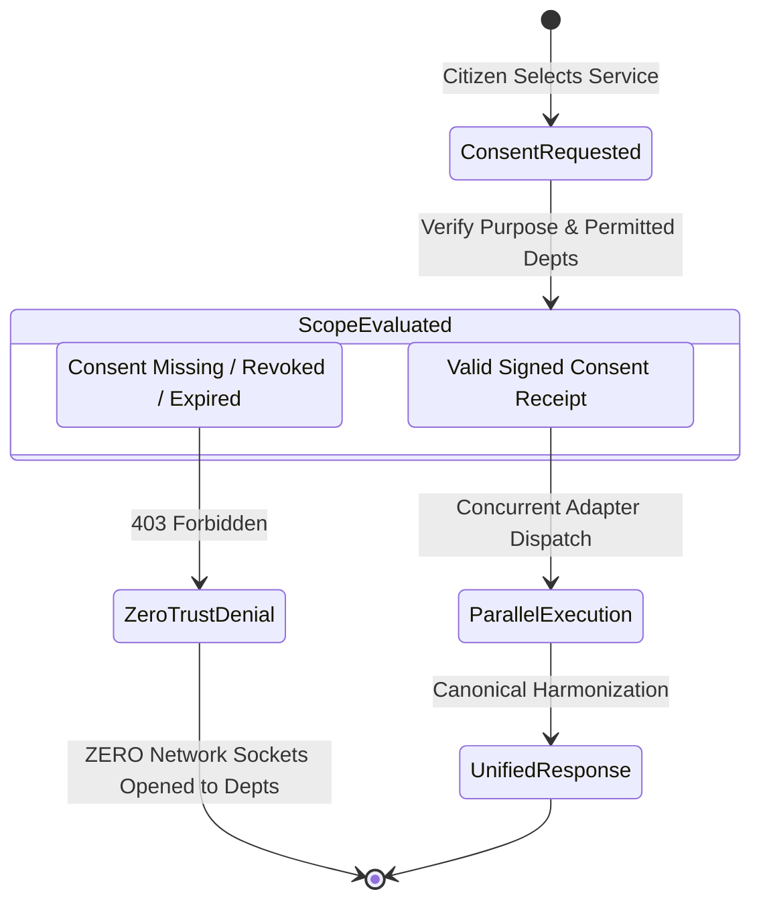
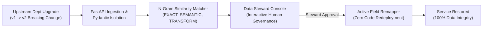

# GovMesh — Consent-Aware Government Interoperability Mesh

[-brightgreen.svg?style=for-the-badge&logo=pytest)](docs/TEST_VERIFICATION.md)

> **Smart India Hackathon (SIH) 2026 — Problem Statement SIH26129**  
> **Problem Title:** *System integration and interoperability among government digital platforms, resulting in fragmented service delivery*  
> **Sponsoring Body:** Government of Maharashtra (Department of IT / e-Governance)  
> **Team Name:** The Code Blooded  
> **Jury & Evaluator Quick Test Guide:** 🏆 **[`JUDGES_TESTING_GUIDE.md`](JUDGES_TESTING_GUIDE.md)**  
> **Demo Walkthrough Video:** [Watch Unlisted 2.5-Minute Demo Video](https://youtube.com) *(Insert Video Link)*

---

## 🏛️ Executive Overview

State governments operate dozens of independent departmental systems across disparate technologies—modern JSON REST APIs, 20-year-old SOAP/XML registries, and asynchronous batch engines. When citizens apply for complex composite services (e.g., Business Registration or Property Transfer), data fragmentation forces repeated manual submissions and bureaucratic delays.

**GovMesh is not another citizen portal.**  
GovMesh is the **governed interoperability middleware beneath state portals like Aaple Sarkar (MahaOnline)**. It federates data across Land Records (Mahabhulekh), IGR Registration, Municipalities, and Tax registries through non-invasive adapters—**preserving 100% departmental data sovereignty without centralized data replication.**

---

## 🏗️ System Architecture Topology

---

## 🔄 End-to-End Transaction Flow

---

## ⚡ Core Technical Innovations & USPs

### 1. Dynamic Purpose-Bound Consent Gate (DPDP Act 2023 Aligned)
* Data is never fetched speculatively.
* An affirmative consent receipt explicitly scopes the requesting service and permitted departments.
* **Zero-Trust Denial Guarantee:** If consent is absent or expired, the gateway aborts execution immediately with zero external network queries.

### 2. Native Multi-Protocol Federation (Zero Rip-and-Replace)
* Integrates disparate protocols in parallel via `asyncio.gather`:
  * **Identity Service (8101)**: JSON REST with Bearer token authentication.
  * **Municipality Service (8102)**: JSON REST with `X-API-Key` headers.
  * **Property Service (8103)**: Legacy SOAP 1.2 XML with XML envelope parsing.
  * **Tax Service (8104)**: Asynchronous 2-phase job dispatch and polling.

### 3. Adaptive Schema Evolution & Governance (The Technical Differentiator)
* Detects upstream breaking changes when external departments upgrade schemas (`v1` $\rightarrow$ `v2`, e.g. `ownerName` $\rightarrow$ `propertyOwnerName`).
* Calculates n-gram similarity match scores (`EXACT`, `SEMANTIC`, `TRANSFORMATION-REQUIRED`).
* Features an interactive human-in-the-loop governance portal for certified **Data Stewards** to approve and activate mappings live.

### 4. Deterministic Graceful Degradation (Zero Hallucination)
* 8 pre-seeded deterministic citizen scenarios (`CIT-1001` to `CIT-1008`).
* When an external department is unavailable (`CIT-1003` Property absent), GovMesh returns a clean partial status with explainable advisory codes.
* **GovMesh NEVER fabricates, hallucinates, or generates fake citizen records.**

### 5. Distributed Traceability & Field-Level Lineage
* End-to-end `X-Correlation-ID` injected and propagated across all microservice hops.
* Field-level data lineage maps every returned value directly to its authoritative source field (`Identity DB.full_name` $\rightarrow$ `GovMesh Canonical.citizen.name`).

---

## 📚 Complete Documentation Suite

All detailed architectural specifications, API contracts, and evaluation guides are organized in the [`docs/`](docs/) directory:

| Document | Description |
| :--- | :--- |
| 🏆 [**Judges & Evaluator Testing Guide**](JUDGES_TESTING_GUIDE.md) | **Step-by-step evaluation workflow for SIH jury members with deterministic test fixtures.** |
| 📖 [**Architecture Specification**](docs/ARCHITECTURE.md) | In-depth system components, database schemas, and microservice topology with Level 0-3 DFDs. |
| 🔄 [**Data Flow & Sequence**](docs/DATA_FLOW.md) | End-to-end sequence diagrams, transaction lifecycles, and concurrency models. |
| 🔌 [**API Contract & Reference**](docs/API_REFERENCE.md) | Endpoints, headers, payload schemas, and authentication flows. |
| 🛡️ [**Security & DPDP Privacy Architecture**](docs/SECURITY_AND_PRIVACY.md) | Zero-trust boundaries, cryptographic tokens, PBKDF2 hashing, and STRIDE threat matrix. |
| 🧬 [**Schema Evolution Engine**](docs/SCHEMA_EVOLUTION.md) | Breaking change detection, similarity heuristics, and Data Steward governance. |
| ⚖️ [**Standards & Legal Compliance**](docs/COMPLIANCE_STANDARDS.md) | Alignment with IndEA 2.0, MeitY Open API Policy, and DPDP Act 2023. |
| ✅ [**Test & Security Verification**](docs/TEST_VERIFICATION.md) | Proof of 88 automated pytest cases, Vitest suites, and security hardening. |
| 🚀 [**Setup & Run Guide**](docs/SETUP.md) | Complete local and Docker installation instructions for developers. |
| 🎯 [**Live Demo Guide & Scenarios**](docs/DEMO_GUIDE.md) | Step-by-step walkthrough of the 8 deterministic citizen scenarios and the new 1-click Demo Hub. |
| 📊 [**Idea PPT Blueprint**](docs/GovMesh_SIH26129_PPT_Blueprint.md) | Official 6-slide SIH idea presentation blueprint following the AICTE template. |

---

## 🚀 Quick Start Guide

### Prerequisites
* Python 3.11 or 3.12
* Node.js 18+ and npm
* PostgreSQL 15+ (Local or Cloud instance like Neon)
* Git

### One-Click Launch (Windows)
Double-click **`start_all.bat`** (or run `.\start_all.ps1` from PowerShell) in the repository root. This boots:
* **Frontend Portal:** `http://localhost:3000`
* **Gateway API & Swagger Docs:** `http://localhost:8000/docs`
* **4 Department Simulators:** Ports 8101, 8102, 8103, and 8104.

*For Docker or manual step-by-step startup instructions, see [docs/SETUP.md](docs/SETUP.md).*

---

## 👥 Evaluator Demo Mode

The web application includes an **Evaluator Demo Suite** banner directly at the top of the interface:
* 🟢 **1. Golden Path (`CIT-1001`)**: All 4 services succeed concurrently.
* 🔴 **2. Zero-Trust Denial**: Demonstrates DPDP Act 2023 policy gate denial when consent is absent.
* 🟡 **3. Graceful Degradation (`CIT-1003`)**: Demonstrates clean partial records with ZERO fake data fabrication when the property registry has no record.
* 🟠 **4. Name Conflict (`CIT-1006`)**: Demonstrates deterministic advisory engine detecting cross-system name discrepancy.
* 🟣 **5. Schema Evolution (v1 $\rightarrow$ v2)**: Demonstrates breaking change detection and Data Steward approval.

---

## 👥 Team & Authorship

**Team Name:** The Code Blooded  
**Problem Statement ID:** SIH26129 (Government of Maharashtra)  

| Name | Role | Stream | Academic Year |
| :--- | :--- | :--- | :--- |
| **Lucky Singh Panwar** | Team Leader | B.Tech CSE | 4th Year (Batch 2023) |
| **Harikesh Kumar** | Core Developer | B.Tech CSE | 4th Year (Batch 2023) |
| **Aman Singh Kunwar** | Core Developer | B.Tech CSE | 3rd Year (Batch 2024) |
| **Abhishek Kumar Gupta** | Core Developer | B.Tech CSE | 3rd Year (Batch 2024) |
| **Arushi Saxena** | Researcher & Designer | B.Tech CSE | 3rd Year (Batch 2024) |
| **Harshita Rai** | AI/ML & Intelligence | B.Tech CSE (AI/ML) | 2nd Year (Batch 2025) |

*(SIH Gender Diversity Compliant: 4 Male, 2 Female).*

---

## 📄 License & Academic Attribution
Developed for the **Smart India Hackathon (SIH) 2026** under Problem Statement **SIH26129** sponsored by the **Government of Maharashtra**.  
All rights reserved by **The Code Blooded** team.
