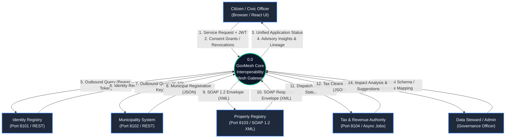
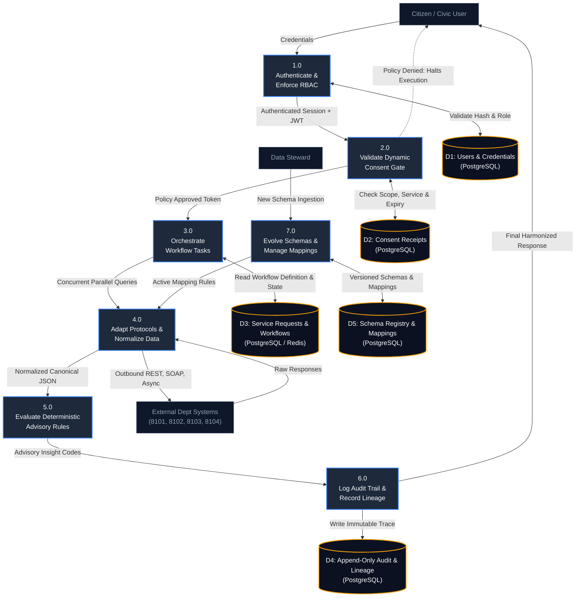
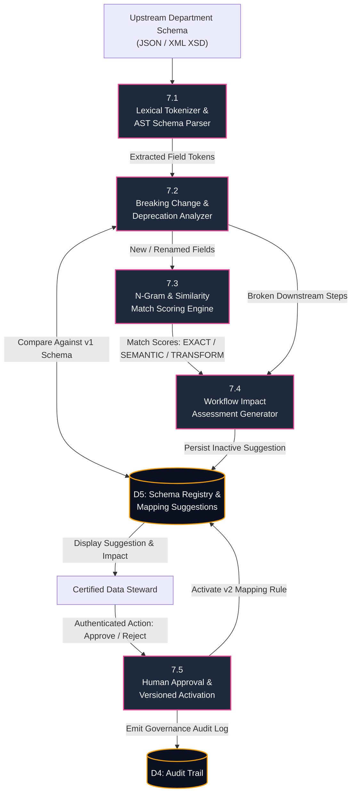

# GovMesh — System Architecture & Data Flow Diagrams (DFD)

**Project:** GovMesh (Consent-Aware Government Interoperability Mesh)  
**Problem Statement ID:** `SIH26129`  
**Sponsoring Organization:** Government of Maharashtra (Department of IT / e-Governance)  
**Theme:** Smart Automation | **Category:** Software  
**Document Classification:** Technical Architecture & Formal DFD Specification  

---

## 1. System Context & Architectural Philosophy

GovMesh is an interoperability middleware prototype designed to federate heterogeneous, legacy departmental databases beneath state single-window portals (such as **Aaple Sarkar / MahaOnline**) without centralized data replication.

### Department Sovereignty vs Centralized Warehouses:
* **The Antipattern (Centralized Database):** Forcing departments to push records into a central data lake violates departmental data sovereignty, creates single points of failure, and exposes personal data under the **DPDP Act 2023**.
* **The GovMesh Pattern (Federated Mesh):** Department databases remain authoritative and sovereign. GovMesh deploys non-invasive protocol adapters (JSON REST, legacy SOAP 1.2 XML, Async Polling), enforces purpose-bound consent gates, and harmonizes responses dynamically.

---

## 2. Level 0 DFD — Context Diagram

The Level 0 Data Flow Diagram illustrates the operational boundary of GovMesh, showing external actors and data exchanges:



---

## 3. Level 1 DFD — Functional System Decomposition

The Level 1 DFD decomposes GovMesh into its 7 primary sub-processes and authoritative data stores:



---

## 4. Level 2 DFD — Workflow Orchestration & Multi-Protocol Adaptation

This deep dive details how Process 3.0 and Process 4.0 handle protocol differences concurrently:

```mermaid
graph TD
    classDef subproc fill:#1e293b,stroke:#06b6d4,stroke-width:2px,color:#f8fafc;
    classDef store fill:#0b1120,stroke:#f59e0b,stroke-width:2px,color:#f8fafc;
    classDef dept fill:#0f172a,stroke:#a855f7,stroke-width:2px,color:#f8fafc;

    PolicyToken["Approved Policy Token<br/>(Correlation ID + Scope)"]

    P31["3.1<br/>Resolve Workflow<br/>Definition Steps"]:::subproc
    P32["3.2<br/>Concurrent Dispatch<br/>(asyncio.gather)"]:::subproc

    P41["4.1<br/>Identity REST Adapter<br/>(Bearer Token Injected)"]:::subproc
    P42["4.2<br/>Municipality REST Adapter<br/>(X-API-Key Injected)"]:::subproc
    P43["4.3<br/>Property SOAP Adapter<br/>(XML Envelope Builder)"]:::subproc
    P44["4.4<br/>Tax Async Adapter<br/>(Two-Phase Job Polling)"]:::subproc
    P45["4.5<br/>Canonical Harmonizer &<br/>Graceful Degradation Handler"]:::subproc

    S_Identity["Identity Svc (8101)"]:::dept
    S_Muni["Municipality Svc (8102)"]:::dept
    S_Property["Property Svc (8103)"]:::dept
    S_Tax["Tax Svc (8104)"]:::dept

    PolicyToken --> P31
    P31 --> P32

    P32 -->|Async Task 1| P41
    P32 -->|Async Task 2| P42
    P32 -->|Async Task 3| P43
    P32 -->|Async Task 4| P44

    P41 <-->|HTTP GET (Bearer)| S_Identity
    P42 <-->|HTTP GET (X-API-Key)| S_Muni
    P43 <-->|HTTP POST SOAP/XML| S_Property
    P44 <-->|POST Job -> Poll GET| S_Tax

    P41 -->|Raw Identity JSON| P45
    P42 -->|Raw Municipal JSON| P45
    P43 -->|Parsed XML Tree| P45
    P44 -->|Resolved Tax JSON| P45

    P45 -->|Isolated Failure Status if Down| Output["Harmonized Canonical Record<br/>(Zero Fake Data Fabricated)"]
```

---

## 5. Level 3 DFD — Schema Evolution & Intelligence Engine

This detailed view explains how Process 7.0 ingests upstream schema changes and governs them:



---

## 6. Technical Specifications & Ports

| Subsystem | Technology | Port | Authentication | Protocol |
| :--- | :--- | :--- | :--- | :--- |
| **Frontend Portal** | React 18 + Vite | `3000` | Session / JWT | HTTPS / WSS |
| **GovMesh Core Gateway** | FastAPI / Python 3.11 | `8000` | Signed JWT (HS256) | REST / JSON |
| **Identity Service** | FastAPI Microservice | `8101` | Bearer Token | REST / JSON |
| **Municipality Service** | FastAPI Microservice | `8102` | `X-API-Key` | REST / JSON |
| **Property Registry** | SOAP Simulator | `8103` | None (Simulated) | SOAP 1.2 / XML |
| **Tax & Revenue Service** | Async Job Simulator | `8104` | None (Simulated) | Asynchronous Polling |
| **Relational Database** | PostgreSQL 16 | `5432` | Standard Password | TCP / SQL |
| **Event / Cache Layer** | Redis 7 | `6379` | Token (Optional) | Redis Protocol |
