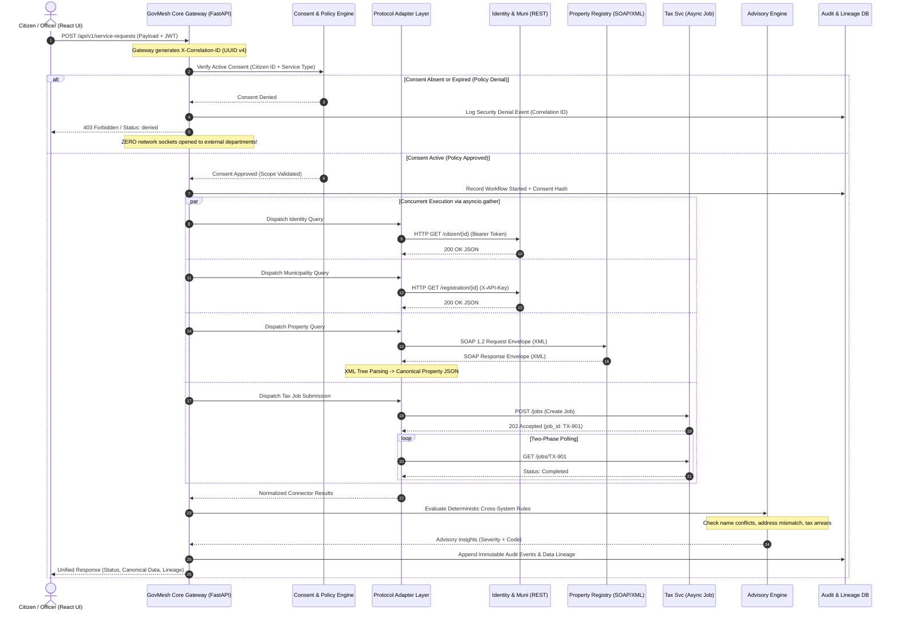
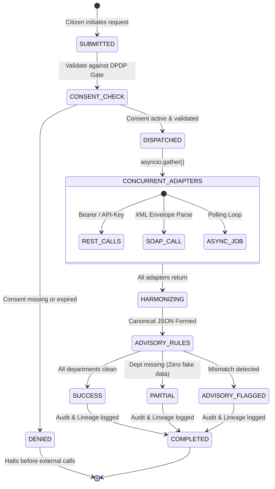

# GovMesh — Data Flow & Transaction Lifecycle Specification

**Project:** GovMesh (Consent-Aware Government Interoperability Mesh)  
**Problem Statement ID:** `SIH26129`  
**Sponsoring Organization:** Government of Maharashtra  

---

## 1. End-to-End Sequence Diagram

---

## 2. Request State Machine Lifecycle

Every transaction in GovMesh transitions through an explicit state machine:

---

## 3. The 8 Deterministic Scenario Fixtures (`CIT-1001` to `CIT-1008`)

To guarantee reproducible evaluations without depending on volatile external network states, GovMesh includes 8 pre-seeded deterministic citizen scenarios:

| Citizen ID | Name | Department Outcomes | Resulting Status | Observed Advisory / Rationale |
| :--- | :--- | :--- | :--- | :--- |
| `CIT-1001` | Asha Verma | Identity: ✅ Muni: ✅ Property: ✅ Tax: ✅ | `success` | Golden path: All records consistent, verified, and tax cleared. |
| `CIT-1002` | Nila Rao | Identity: ✅ Muni: ✅ Property: ✅ Tax: ⚠️ | `success` | `TAX_CLEARANCE_NOT_CONFIRMED`: Tax due with outstanding ₹14,500.50. |
| `CIT-1003` | Omar Das | Identity: ✅ Muni: ✅ Property: ❌ Tax: ✅ | `partially_completed` | `DEPARTMENT_RESULTS_UNAVAILABLE`: Property record absent; returns partial status without fake data. |
| `CIT-1004` | Leela Sen | Identity: ✅ Muni: ❌ Property: ✅ Tax: ✅ | `partially_completed` | `DEPARTMENT_RESULTS_UNAVAILABLE`: Municipal registration absent; no hallucinated registration. |
| `CIT-1005` | Ishan Kapoor | Identity: ❌ Muni: ✅ Property: ✅ Tax: ✅ | `partially_completed` | `DEPARTMENT_RESULTS_UNAVAILABLE`: Identity record absent; fails gracefully without substitute. |
| `CIT-1006` | Kabir Jain | Identity: ✅ Muni: ✅ Property: ⚠️ Tax: ✅ | `success` | `CROSS_SYSTEM_NAME_MISMATCH`: Property owner name differs (`Kabir A. Jain` vs `Kabir Jain`). |
| `CIT-1007` | Mira Bose | Identity: ✅ Muni: ⚠️ Property: ✅ Tax: ✅ | `success` | `CROSS_SYSTEM_ADDRESS_MISMATCH`: Municipal address conflicts with Identity address. |
| `CIT-1008` | Tara Mehta | Identity: ✅ Muni: ✅ Property: ✅ Tax: ⏳ | `pending_external` | Tax job in progress; returns non-terminal status until job completion is polled. |

---

## 4. Failure Isolation & Concurrency Model

### Parallel Concurrency via `asyncio.gather`
Instead of executing sequential queries that compound latency:
$$\text{Total Latency} = \max(t_{\text{identity}}, t_{\text{muni}}, t_{\text{property}}, t_{\text{tax}})$$
The gateway fires all 4 queries concurrently. A network timeout on one adapter does not stall the execution of remaining adapters.

### Zero-Hallucination Degradation Principle
When an external department fails or is unreachable:
1. The error is isolated to that microservice's sub-object in the JSON response.
2. The overall response status transitions to `partially_completed`.
3. **No fake or dummy data is ever inserted** into missing fields.
4. Downstream civic officers receive an explicit warning badge identifying exactly which department record was absent.
