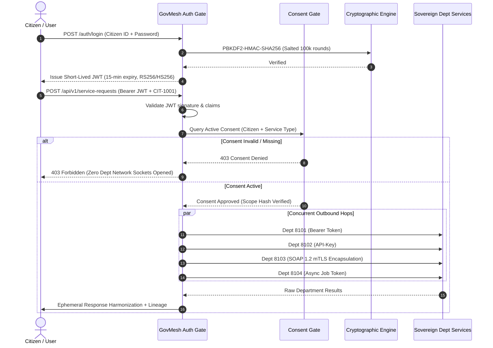
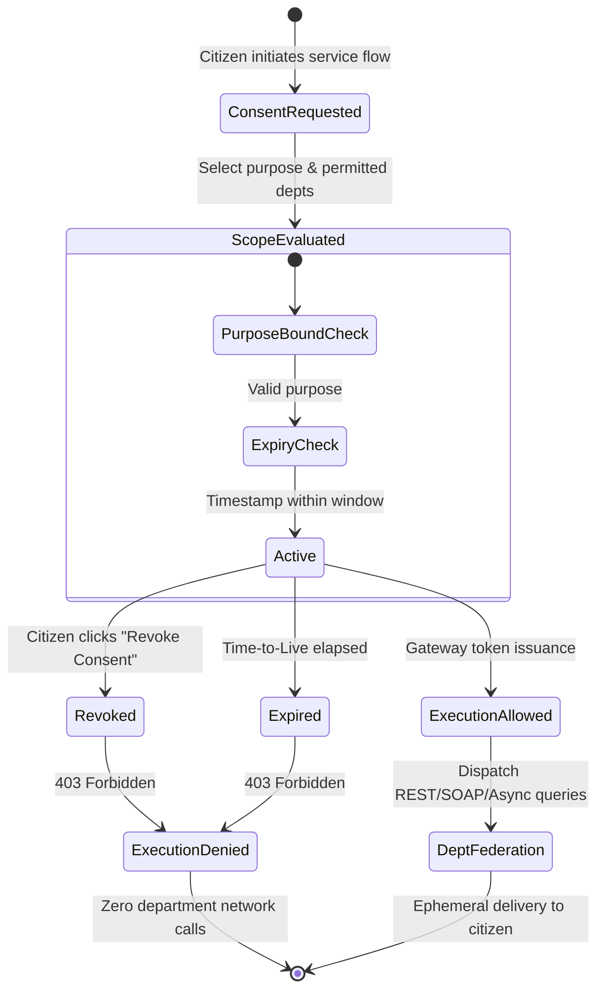

# GovMesh — Security & Privacy Architecture Specification

**Project:** GovMesh (Consent-Aware Government Interoperability Mesh)  
**Problem Statement ID:** `SIH26129`  
**Sponsoring Organization:** Government of Maharashtra (Department of IT / e-Governance)  
**Legal Framework Alignment:** Digital Personal Data Protection (DPDP) Act 2023 & India Enterprise Architecture (IndEA 2.0)  

---

## 1. Security Philosophy: Zero-Trust & Federated Sovereignty

State government data architectures frequently suffer from two opposing antipatterns:
1. **The Siloed Fragmentation Trap:** Every department operates in complete isolation, requiring citizens to carry physical papers and re-enter confidential data across multiple portals.
2. **The Centralized Data Lake Trap:** Forcing all departments to replicate citizen records into a single monolithic database. This creates a catastrophic single point of failure, violates departmental autonomy, and creates massive liability under the DPDP Act 2023.

**GovMesh implements Federated Interoperability with Zero-Trust:**
* **No Centralized Data Re-Hosting:** GovMesh acts solely as an intelligent communication and governance mesh. It queries authoritative registries in real-time, harmonizes payloads, and does not maintain persistent copies of citizen master records.
* **Zero-Trust Consent Enforcement:** By default, GovMesh refuses to route network packets to any departmental microservice unless a valid, unexpired, purpose-specific consent receipt is cryptographically verified.

---

## 2. DPDP Act 2023 Legal Alignment Matrix

GovMesh was designed from the ground up to reflect the statutory mandates of the **Digital Personal Data Protection Act, 2023**:

| DPDP Act 2023 Section | Statutory Requirement | GovMesh Architectural Implementation |
| :--- | :--- | :--- |
| **Section 6(1)** | *Consent must be free, specific, informed, unconditional, and unambiguous with clear notice.* | Pre-transaction Consent Screen details exact purpose (e.g. `business_registration`) and permitted departments. |
| **Section 6(4)** | *Data Principal has the right to withdraw consent with the ease of giving it.* | Real-time `/api/v1/consent/revoke` endpoint immediately invalidates active consent receipts; subsequent queries abort instantly. |
| **Section 6(7)** | *Consent Manager must represent the Data Principal to manage and review consent.* | Built-in Consent Governance dashboard providing citizens visibility over active, expired, and revoked consent artifacts. |
| **Section 8(1)** | *Data Fiduciary shall implement appropriate technical and organizational measures to ensure compliance.* | End-to-end audit trail, role-based access control (RBAC), and deterministic advisory validation rules. |
| **Section 8(7)** | *Data Fiduciary shall erase personal data upon purpose fulfillment or consent withdrawal.* | Bounded processing: Raw payloads are ephemeral; only verifiable transaction audit receipts and lineage fingerprints are retained. |

---

## 3. Cryptographic Token & Authentication Lifecycle

### Cryptographic Primitives:
* **Password Storage:** Salted `PBKDF2-HMAC-SHA256` with 100,000 iterations and unique 16-byte random salts.
* **Session Integrity:** Signed JSON Web Tokens (JWT) containing cryptographic nonces, role claims (`citizen`, `officer`, `admin`, `data_steward`), and strict 15-minute expiration windows.
* **Audit Immutability:** Audit records are append-only. Each log entry incorporates the unique `X-Correlation-ID` and a cryptographic SHA-256 fingerprint of the operational context.

---

## 4. Zero-Trust Consent Gate State Machine

---

## 5. Threat Modeling & Defensive Controls (STRIDE Matrix)

GovMesh mitigates threats across all six STRIDE categories:

| Threat Category | Potential Attack Vector | GovMesh Defensive Mitigation |
| :--- | :--- | :--- |
| **Spoofing Identity** | Malicious actor pretending to be a citizen or government officer. | Short-lived signed JWTs, mandatory password hashing with salt, and fine-grained Role-Based Access Control (RBAC). |
| **Tampering with Data** | Intercepting and altering SOAP/XML property records or REST responses. | TLS 1.3 encryption across all adapter hops, XML envelope schema validation, and SHA-256 integrity fingerprinting. |
| **Repudiation** | An officer or department claims they never processed or authorized a record. | Distributed `X-Correlation-ID` propagated through all microservices; append-only audit trail with actor timestamps and field lineage. |
| **Information Disclosure** | Unauthorized cross-departmental data leakage or bulk data scraping. | Strict DPDP Consent Gate aborts with 403 before any department adapter is invoked; zero speculative pre-fetching. |
| **Denial of Service** | A lagging or unresponsive legacy SOAP registry freezes the entire gateway. | Asynchronous concurrency with `asyncio.gather`, per-service configurable timeouts, and deterministic graceful degradation. |
| **Elevation of Privilege** | Citizen attempting to access Data Steward schema evolution or admin endpoints. | Endpoint-level role enforcement decorators (`Depends(get_current_steward_user)`). |

---

## 6. Production Hardening Roadmap (Beyond SIH Hackathon)

For national-scale rollout under the National e-Governance Division (NeGD) and Maharashtra IT Department:
1. **Hardware Security Module (HSM) Integration:** Signing consent artifacts using FIPS 140-2 Level 3 HSM keys.
2. **Mutual TLS (mTLS) Mesh:** Deploying an Istio/Envoy service mesh enforcing mutual certificate verification between GovMesh and legacy state servers.
3. **Differential Privacy in Audit Logs:** Masking citizen identifiers in public-facing transparency dashboards while retaining auditability for judicial review.
