# Demo hardening evidence

These images were captured from the real local, non-Docker GovMesh stack on 2026-09-10. The run used an isolated SQLite database, fictional `.example` accounts, and synthetic departmental services. No credentials, authorization headers, or database URLs are included.

## E01 — Deterministic scenario selector

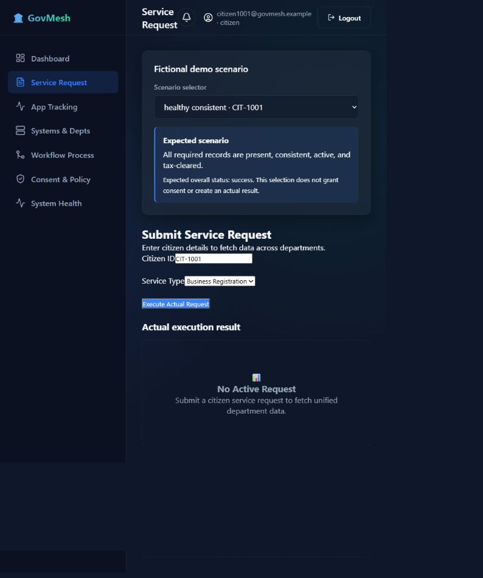

- Scenario/citizen: Healthy records / `CIT-1001`
- Steps: log in as the matching fictional citizen, open Service Request, select the healthy scenario.
- Expected and observed: the selector prefills the citizen and appropriate service, explains the scenario, and does not silently grant consent or manufacture an actual result.
- Proves: expected demo conditions are visually separated from actual execution.
- Limitation: scenario records are synthetic fixtures.

## E02 — Consent denial and zero connector calls

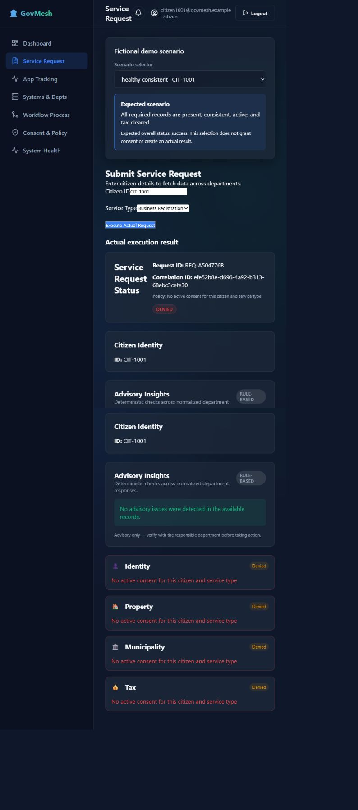

- Scenario/citizen: Healthy records / `CIT-1001`
- Request/correlation: `REQ-A504776B` / `efe52b8e…`
- Steps: revoke/omit consent, submit a service request, inspect the denied result.
- Expected and observed: policy denial occurs before departmental execution and the UI shows no department results.
- Proves: the real request is denied by the authorization boundary.
- Limitation: the screenshot alone cannot prove zero network calls; regression test `test_denied_request_and_manual_start_make_zero_connector_calls` supplies that instrumentation evidence.

## E03 — Scoped consent and healthy four-department execution

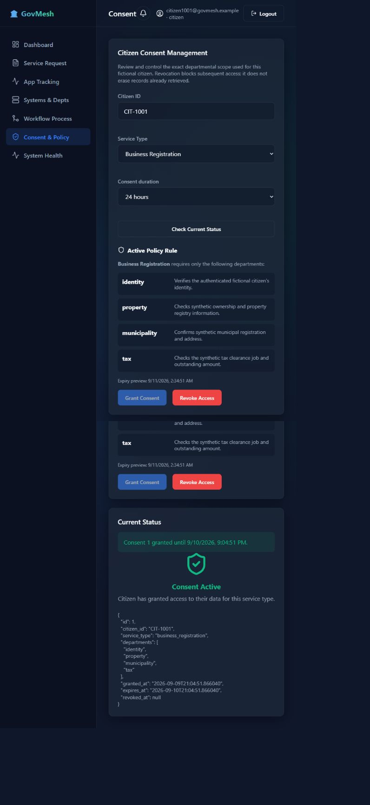

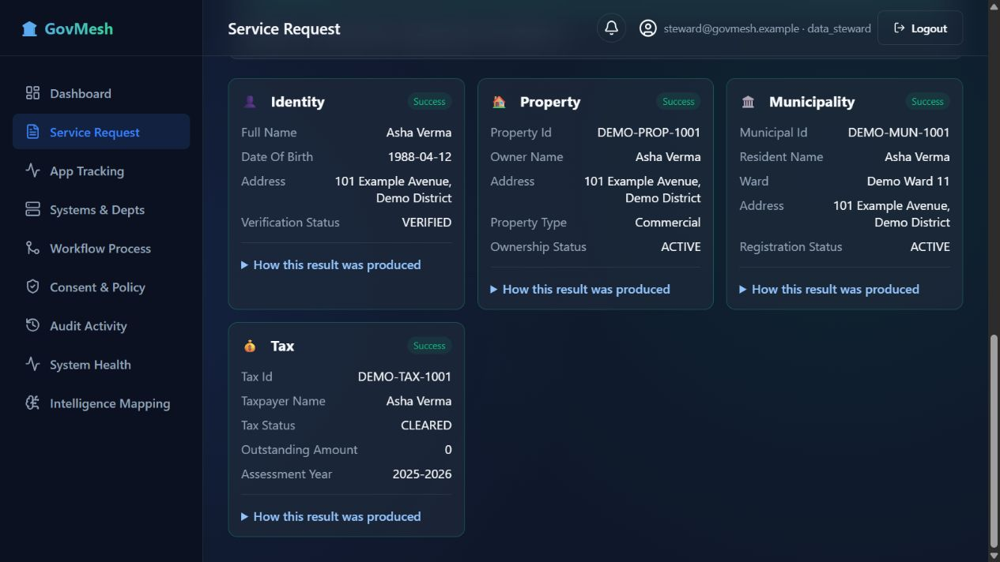

- Scenario/citizen: Business Registration / `CIT-1001`
- Request/correlation: `REQ-E3B69FF2` / `3b4438e5…`
- Steps: review the canonical four-department scope, grant consent, submit the request, inspect actual results.
- Expected and observed: Identity, Property, Municipality, and Tax all return successful normalized results.
- Proves: consent scope and the real multi-adapter workflow are connected end to end.
- Limitation: the four department applications are local simulators, not government production systems.

## E04 — SOAP/XML protocol normalization

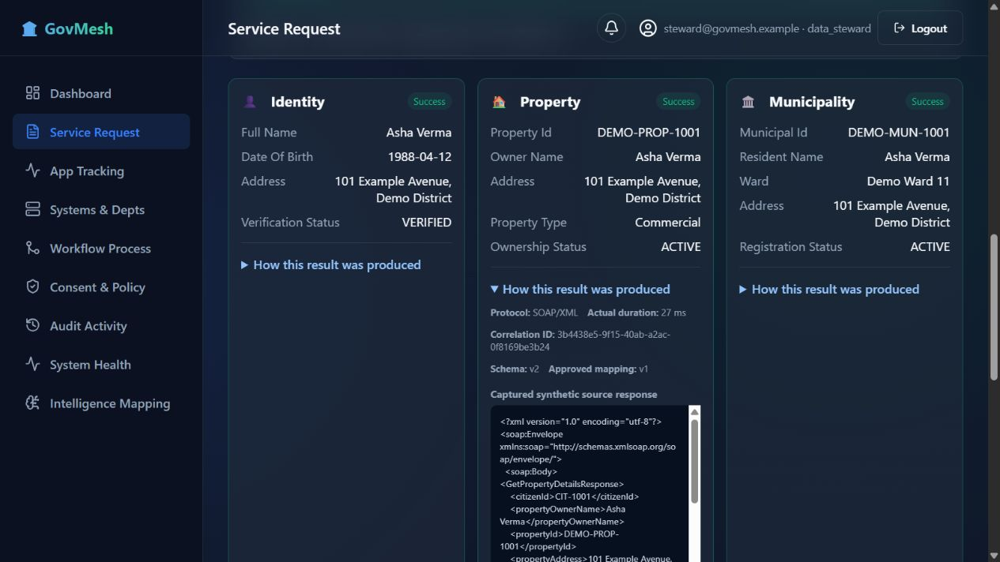

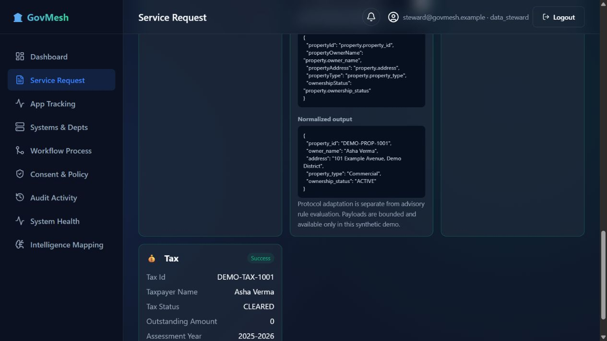

- Scenario/citizen: Healthy records / `CIT-1001`
- Request/correlation: `REQ-E3B69FF2` / `3b4438e5…`
- Steps: expand Property in “How this result was produced”; inspect captured source, allowlisted field mapping, and normalized JSON.
- Expected and observed: a captured SOAP/XML response is converted into the canonical Property shape with protocol, timing, schema, and mapping metadata.
- Proves: the view is sourced from that execution rather than reconstructed from expected scenario data.
- Limitation: raw inspection is deliberately available only to authorized users in enabled demo/development environments and payload storage is bounded.

## E05 — Advisory mismatch finding

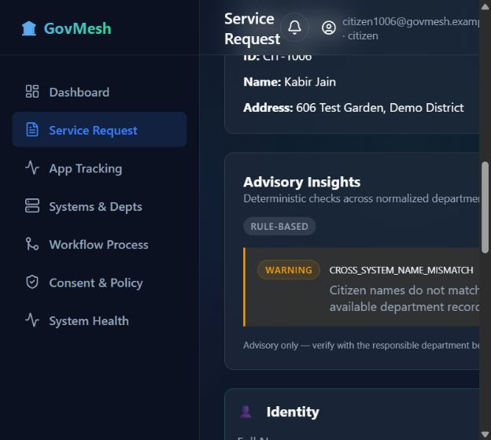

- Scenario/citizen: Name mismatch / `CIT-1006`
- Request/correlation: `REQ-1F70493B` / `e9f02914…`
- Steps: grant scoped consent, execute the scenario, inspect rule-based advisory insights.
- Expected and observed: successful departmental retrieval remains visible while a Property owner-name mismatch is reported as an advisory.
- Proves: protocol adaptation and deterministic advisory evaluation are separate concerns.
- Limitation: the score is a heuristic match score, not a probability or learned-model accuracy claim.

## E06 — Pending tax job completion

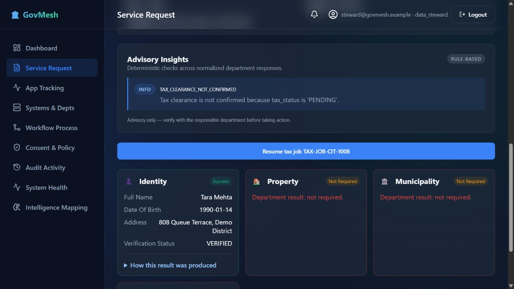

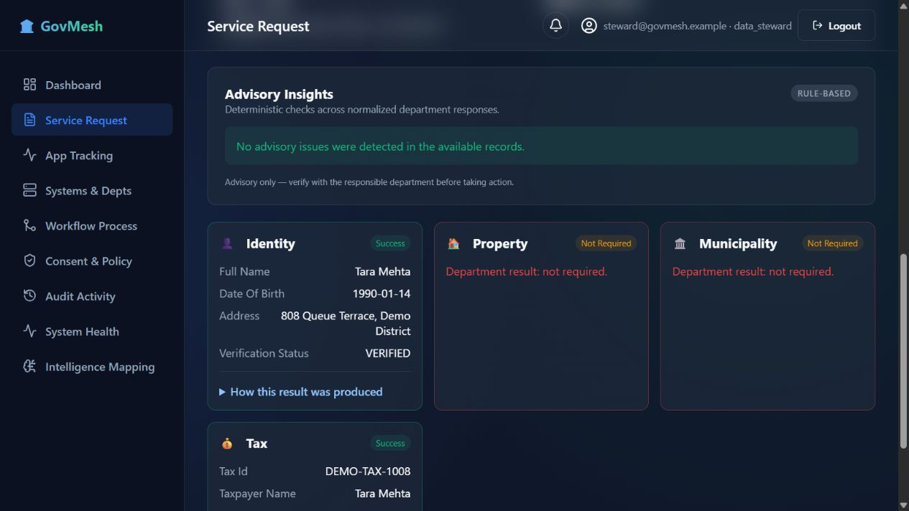

- Scenario/citizen: Pending tax / `CIT-1008`
- Request/correlation/job: `REQ-A422087D` / `ab5a2d47…` / `TAX-JOB-CIT-1008`
- Steps: submit once, observe the pending result, use the authorized Resume action, then inspect the same request and job.
- Expected and observed: status advances pending → processing → completed; successful department steps are retained and insights refresh.
- Proves: completion is a persisted state transition, not a fabricated terminal response or duplicate submission.
- Limitation: the demo uses explicit bounded resume calls instead of a distributed scheduler.

## E07 — Real schema incompatibility

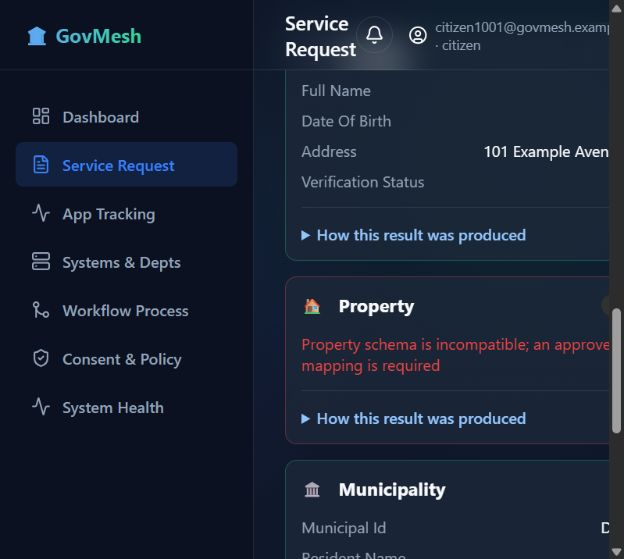

- Scenario/citizen: Property schema v2 / `CIT-1001`
- Request/correlation: `REQ-038AACB6` / `091dee71…`
- Steps: a steward switches the actual Property response to v2; the citizen executes before an approved v2 mapping exists.
- Expected and observed: Property fails normalization with a schema incompatibility while healthy departments remain visible.
- Proves: the connector does not silently fall back or report false success.
- Limitation: the controlled schema mutation is restricted to synthetic demo state.

## E08 — Steward approval and v2 recovery

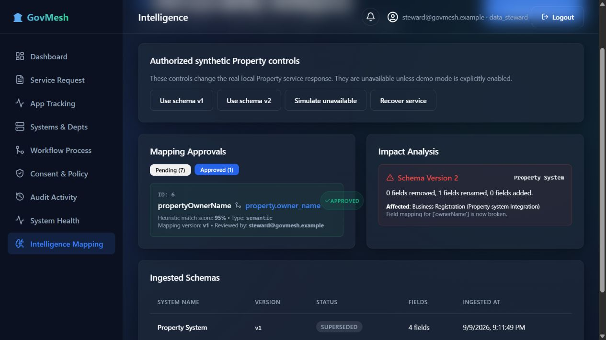

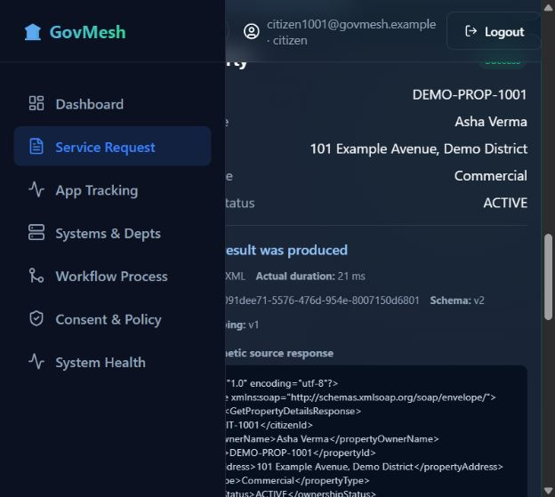

- Scenario/citizen: Property schema v2 / `CIT-1001`
- Mapping/request: mapping `6`, version `1`, approved by `steward@govmesh.example`; `REQ-038AACB6`
- Steps: the authenticated steward reviews and approves the constrained suggestion; retry the failed Property step and execute a subsequent new request.
- Expected and observed: the connector consults the active mapping, the failed request recovers, and subsequent v2 execution succeeds.
- Proves: approval changes runtime connector behavior and records version/actor metadata.
- Limitation: supported recovery is intentionally constrained to allowlisted Property fields; it is not arbitrary automatic schema repair.

## E09 — Department outage and targeted retry

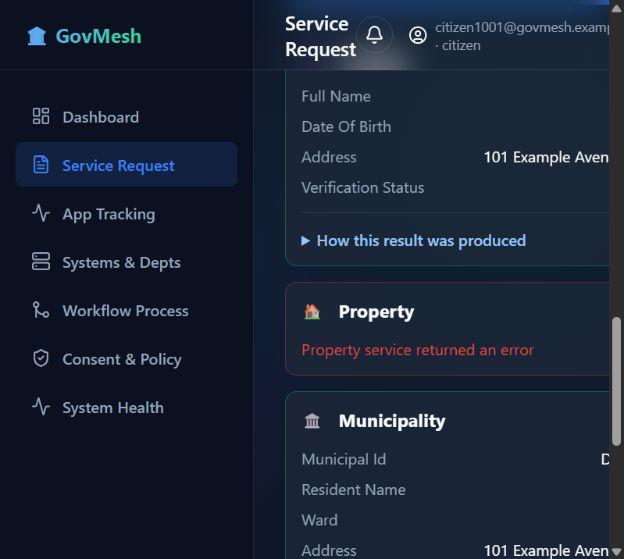

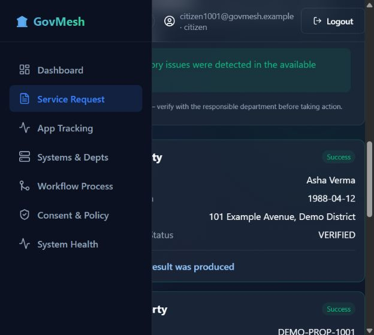

- Scenario/citizen: Property unavailable / `CIT-1001`
- Request/correlation: `REQ-D378E773` / `68fca…`
- Steps: enable the steward-only Property outage, submit once, restore the department, retry only failed work.
- Expected and observed: Property first fails without fabricated data, then succeeds on the same request while completed steps remain intact.
- Proves: bounded recovery is real and does not rerun successful departments.
- Limitation: failure injection is disabled outside explicitly enabled demo/development environments.

## E10 — Audit actor, correlation, and mapping version

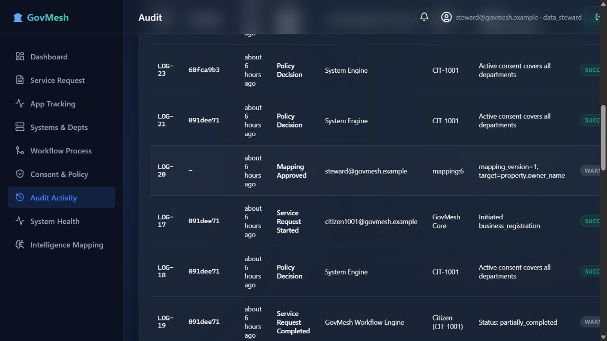

- Scenario/citizen: Property schema recovery / `CIT-1001`
- Mapping: `6`, version `1`
- Steps: open Audit Activity as an authorized steward and inspect mapping approval and correlated execution events.
- Expected and observed: actor, outcome, time, correlation, and mapping version are persisted and displayed.
- Proves: governance actions are attributable and execution evidence can be correlated.
- Limitation: records are append-only by application design, not cryptographically tamper-proof.

## E11 — Automated verification

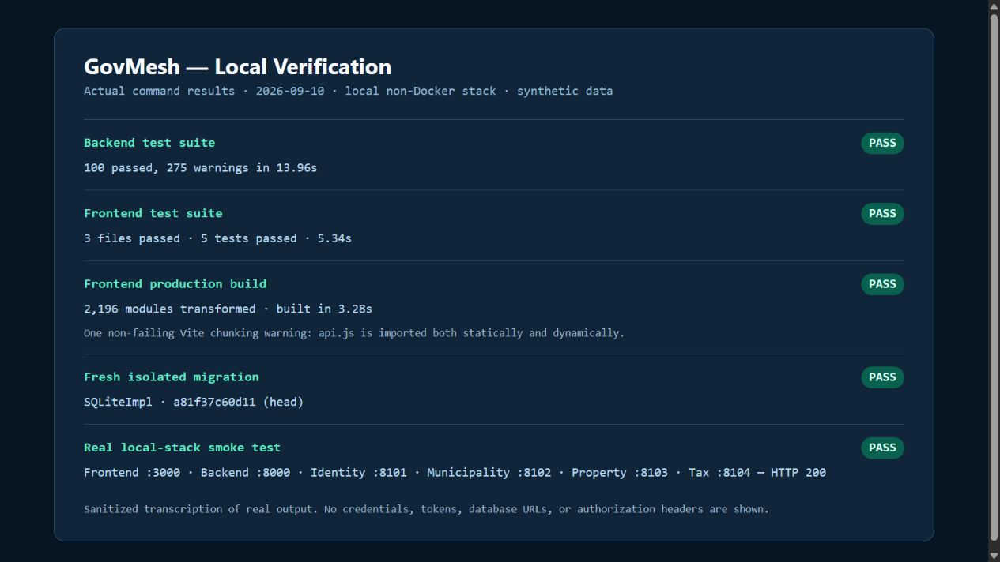

- Steps: run the complete backend suite, frontend suite, production build, fresh migration, and six-port smoke test.
- Expected and observed: all suites pass, build succeeds, migration reaches head, and local endpoints return HTTP 200.
- Proves: the committed implementation was exercised beyond the browser demonstration.
- Limitation: the image is a sanitized transcription of the real command output; the exact commands and results are recorded in [`test-summary.txt`](test-summary.txt).

## Additional captures

`E00-authenticated-dashboard.png`, `E04-property-soap-inspection.png`, `E06a-tax-pending-job.png`, and `E07-schema-v2-pending-mapping.png` provide supporting UI context but are not relied upon as standalone proof of a security guarantee.
